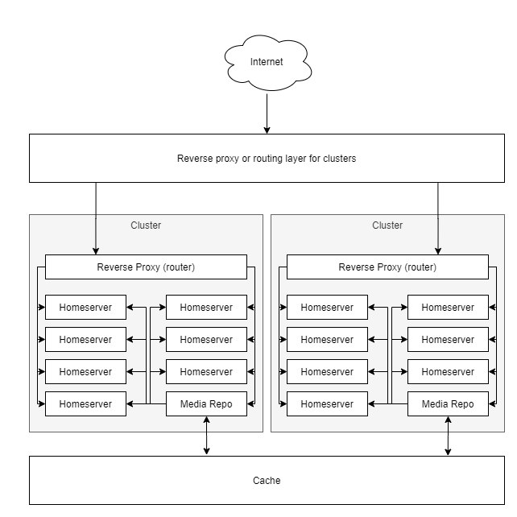

# Hosting providers

Hosting providers offering homeservers of any size can make use of this project to lower costs
associated with hosting media, and to manage/report usage of the media repository.

For single region or single datacenter structures, the "Multiple Servers" environment will be a
better fit.

For more complicated structures, such as multi-region or size differences in the offering, the
following infrastructure diagram might apply:

Each cluser is essentially a "Multiple Servers" style deployment with a shared cache layer across
the entire DC or region. This cache layer can be used by the media repo instances to more easily share
media across clusters within the DC/region. The media repos might still duplicate media between
themselves, however this is generally better than trying to set up a single media repo for thousands
of servers.

In general it is recommended to keep the number of servers associated with a single media repo to
less than 250. Keeping the number below 100 is even more ideal due to traffic considerations.
